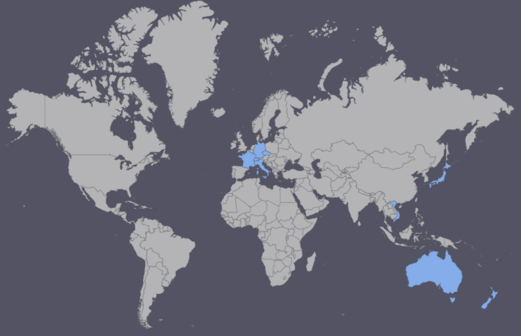

+++
title = "Countries Visited"
date = "2016-01-31"
slug = "countries-visited"
lastmod = "2017-03-03"
type = "post"

[taxonomies]
categories = [ "Travel",]

[extra]
image = "posts/2016/countries-visited/countries_visited.png"

+++

And one more item that was [on my 101 Things list from Switzerland](/posts/2016/101-thing-in-1001-days):

* <del>Travel to at least 15 different countries</del>.

I thought it was worth having it's own post to list them all.

1. [New Zealand](/tags/new-zealand)
2. [Switzerland](/tags/switzerland)
3. [France](/tags/france)
4. [Germany](/tags/germany)
5. [Liechtenstein](/tags/liechtenstein)
6. [Italy](/tags/italy)
7. [Vatican City](/tags/vatican-city)
8. [Czech Republic](/tags/czech-republic)
9. [Vietnam](/tags/vietnam)
10. [Fiji](/tags/fiji)
11. [Japan](/tags/japan)

If you count layovers (but I'm not):

* Thailand (Bangkok Airport)
* <del>Austria (Train Station)</del>
* China (Hong Kong Airport)
* Singapore (Airport)

**Updated Mar 2017:** New countries added (now more than 15).

1.  [Indonesia (Bali)](/tags/indonesia)
2.  [United Kingdom](/tags/uk)
3.  [Iceland](/tags/iceland)
4.  [Sweden](/tags/sweden)
5.  [Denmark](/tags/denmark)
6.  [Croatia](/tags/croatia)
7.  [Slovenia](/tags/slovenia)
8.  [Austria](/tags/austria)
9.  [Republic of Ireland](/tags/ireland)