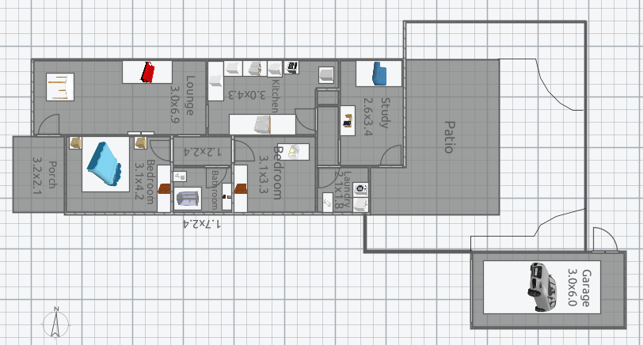
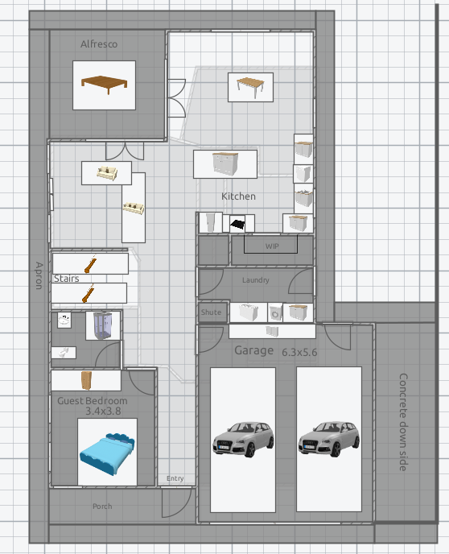
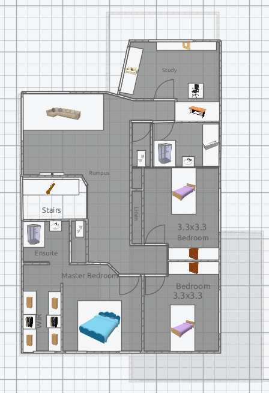
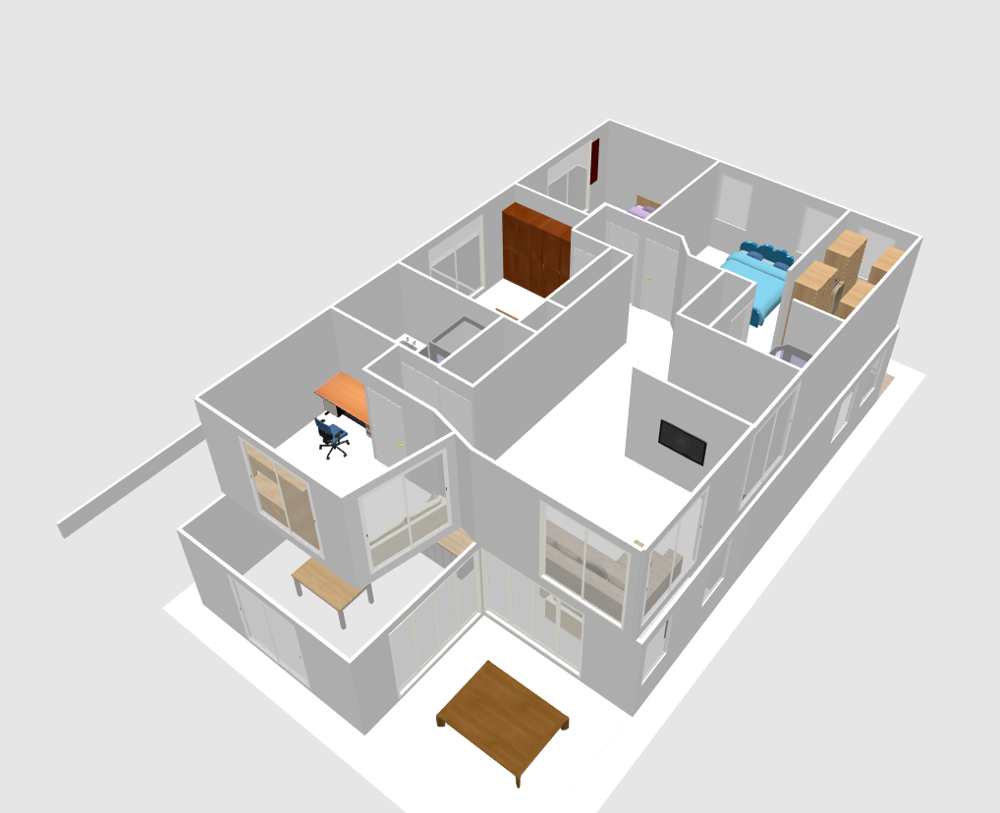
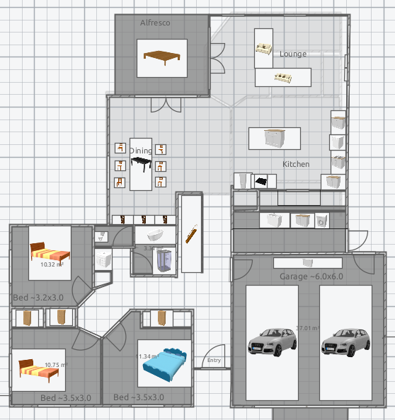
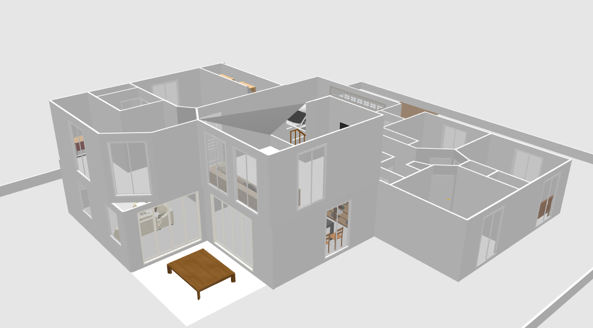
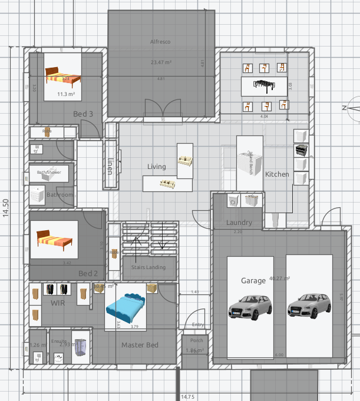
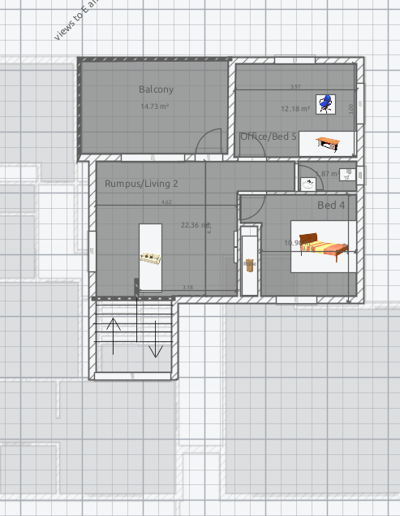
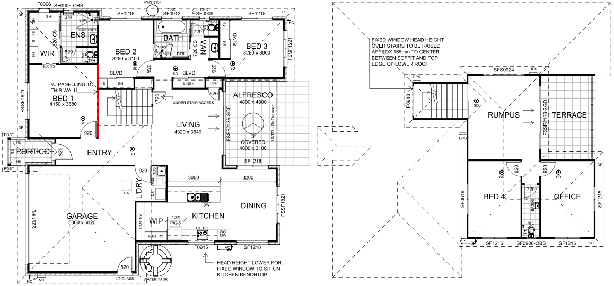

+++
categories = ['Misc']
date = '2020-12-09'
featured_image = 'posts/2020/house-design/Design3-3D.png'
slug = 'house-design'
tags = ['House Build']
title = 'House Design'
type = 'post'

+++

Rachael had found an open house to inspect when Lyra was only 12 days old, after deciding our current house was too small now we had a baby. We couldn't find any existing houses on the market that were what we wanted, so we bought a block of land that came up at the end of last year, and we've spent most of this year finalising a design.

Of the builders we visited, we couldn't find a house plan that was exactly what we wanted either, so we'd have to come up with our own. I found a free program online called [Sweet Home 3D](http://www.sweethome3d.com) that made it quite easy to sketch things up and look at it in 3D with furniture. Although it's a bit fiddly and sometimes glitchy it worked pretty well for a free program. In order to learn the program, I drew up our current place. This also helped to get a feel for dimensions of rooms and what sizes we would want.

Our new block is actually smaller then our new one. Our current block is only 14x56m (quite long and narrow) vs the new one at 20x30m. You lose at least 2m each side, 6m at the front, and about 8m out the back (due to steep drop off) which meant that our footprint couldn't exceed 16x16m. (Our existing house is about 6.2x14.9m)

We wanted a master, 2 kids bedrooms, a guest bedroom and a study (so 4-5 bedrooms all up). The amount of rooms we wanted and the fact that we wanted to make use of the view to the back of the block meant we needed to build two-storey (which costs more).

We wanted at least one room and bathroom on the ground floor so that if someone broke their leg or the grandparents were visiting it would be possible to access everything you needed without going upstairs, which also meant the kitchen had to be downstairs. The design we had in mind was actually similar to a display home we visited in Highfields, the [Hotondo Jaxton](https://hotondo.com.au/display-homes/jaxton-display-highfields/), it was flipped a bit but pretty close.

We spent a few months trying to get a quote out of Hotondo (which we never got) but after getting rough quotes from other builders for similar designs worked out this was going to be more than our budget. That design was about 324m2 and we learned that they essentially quote $1200/m2 for 2-storey builds and so we needed to reduce the footprint size.

So we moved a bunch of things downstairs so that we could remove the 3rd bathroom, and make it so that only part of the house was two-storey in the hope that would make the build easier and cheaper.

I still like the 2nd design but we decided it wouldn't work for small children as you don't want to have to go up and down the stairs at night every time they cry out. I struggled getting things to fit on our block neatly after moving the master downstairs. We considered going to see an architect for help, but eventually I was able to get something to fit that we were happy with.

Our thinking was that this way their are two downstairs kids bedrooms for when they are young, with a guest and office upstairs, but that can be swapped for older kids if they want to move upstairs.

Finally, the draftsman did the design up properly and made sure it all ligned up, and we made a few more tweaks. We now have something we are ready to build!

