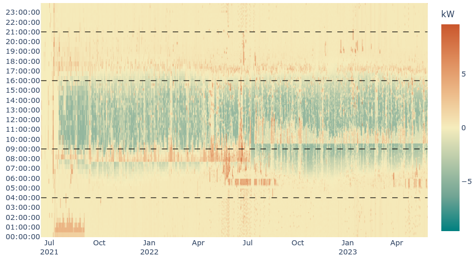
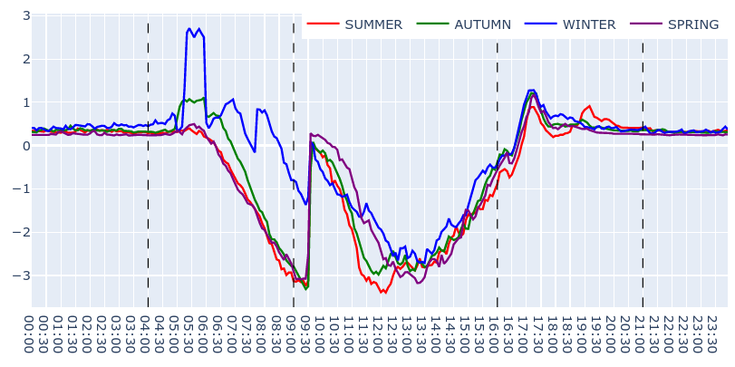

+++
title = "Energy Usage"
date = "2023-07-01"
slug = "energy-usage"
type = "post"

[taxonomies]
categories = [ "Misc",]

[extra]
image = "posts/2023/energy-usage/heatmap.png"

+++

I did [a post a few years back](/posts/2019/energy-data/) looking at our energy usage at our old house. We've been in the new place for 2 years now and with solar and electric hot water and cooking the charts are more interesting now.

If you know a little bit of python I've [published the script used to make these charts](https://github.com/aguinane/energy-report#energy-report) if you want to run with your own data.

We got the hot water system put on a timer when we moved in and I originally set it to run from 08:00 - 15:00 with a top up at midnight, but after getting the first bill back quickly realised most of the hot water heating was happening at night time and not using the solar. So I got rid of the night-time timer and we have never ended up with cold water. I later changed it again to come on later (from 09:30) to make even better use of the free solar.

The other significant loads are:
- Aircon heating on winter mornings
- Typical evening cooking etc. (can't do much about that)
- A tiny bit off aircon cooling in the summer evening (but less then heating - so cancels out for time-of-use tariffs)

A new time of use tariff came out today (12C) that is designed for people with battery systems, but looks pretty good for us in Toowoomba even without a battery given most of our load is outside of that evening period.
According to the [Energy Made Easy](https://www.energymadeeasy.gov.au) website it's the best option too.

