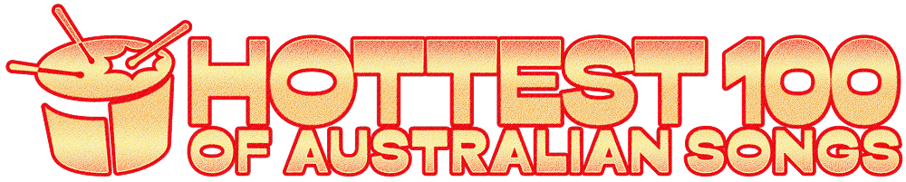

+++
title = "Hottest 100 of Australian Songs"
date = "2025-07-01"
slug = "hottest-100-australian"
type = "post"

[taxonomies]
categories = [ "Misc",]
tags = [ "Hottest 100",]

[extra]
image = "posts/2025/hottest.png"

+++

I had a massive shortlist for this one, so added a few rules to narrow it down.

- At least one song from each decade for Top 5 - broke this one for the 2020s since it's not over yet (and whilst a few made my shortlist there were better choices in the other decades).
- Stick to the short list - broke this one for The Cat Empire (as whilst Hello made sense, they have better songs then The Car Song and Wolves).

1. Cold Chisel - Khe Sahn (70s)
2. Crowded House - Don't Dream It's Over (80s)
3. The Living End - Prisoner of Society (90s)
4. The Cat Empire - The Wine Song (00s)
5. Ball Park Music - She Only Loves Me When I'm There (10s)
6. The Whitlams - No Aphrodisiac (90s)
7. Gotye - Learnalilgivinanlovin (00s)
8. Bluejuice - Act Your Age (10s)
9. Missy Higgins - The Special Two (00s)
10. The Preatures - Is This How You Feel? (10s)
