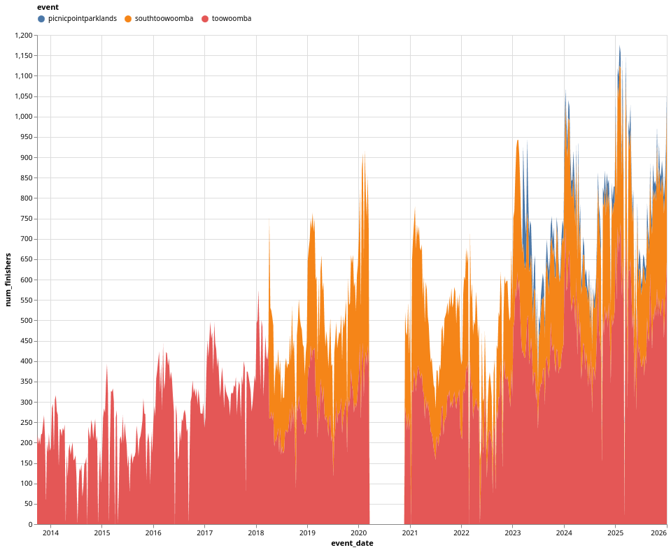
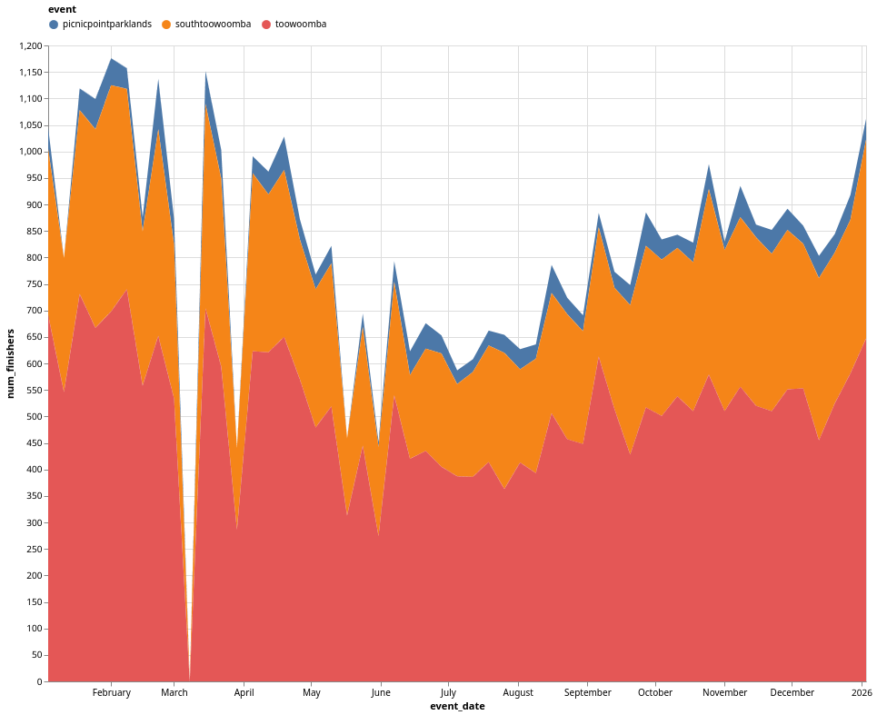
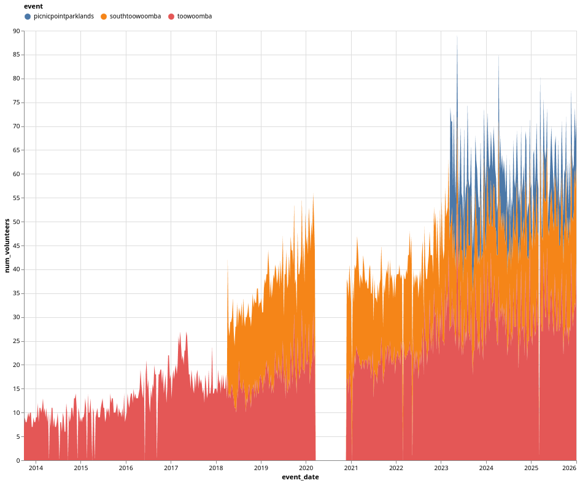
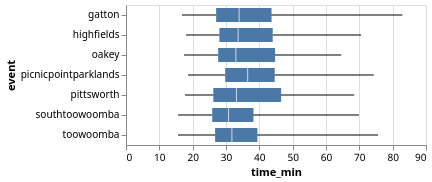

+++
title = "Parkrun Stats"
date = "2026-01-21"
slug = "parkrun-stats"
type = "post"

[taxonomies]
categories = [ "Misc",]
tags = [ "Toowoomba",]

[extra]
image = "posts/2026/parkrun-stats-2025/times_2025.png"

+++

Somebody had posted a graph of the historical finisher count for Toowoomba Parkrun in preperation for New Years (which generally peaks in January). I was curious what it would like like for all 3 Toowoomba events though, so here it is:

There is a very clear seasonal trend with everyone starting in January (New Years resolutions?) and then getting scared off when it gets cold in winter.

You can also see when South Toowooomba opened and pulled about a third of people across - but Picnic Point wasn't as popular. You can also see the covid lockdowns (2020 and 2022) and TC Alfred in early 2025. 

Here's the chart just for 2025:

And number of volunteers as well:

I was curious how all the regional events vary speed wise also - so downloaded all the results for 2025. The order changes on how you sort it (all kinds of sample bias skews).

| event                | fastest | p01  | p05  | p10  | p50  | p95  | p99  | slowest | sample size |
|----------------------|---------|------|------|------|------|------|------|---------|-------|
| southtoowoomba       | 15.7    | 18.7 | 20.9 | 22.5 | 30.8 | 52.8 | 60.5 | 69.8    | 14,189 |
| pittsworth           | 17.8    | 19.7 | 21.8 | 23.0 | 33.1 | 58.3 | 63.6 | 68.4    | 1,337  |
| toowoomba            | 15.7    | 19.1 | 21.8 | 23.5 | 31.8 | 54.5 | 60.8 | 75.5    | 25,553 |
| gatton               | 16.9    | 18.9 | 22.3 | 23.9 | 33.9 | 58.2 | 65.6 | 82.9    | 5,283  |
| highfields           | 18.2    | 20.2 | 22.6 | 24.8 | 33.6 | 56.5 | 61.8 | 70.4    | 4,921  |
| oakey                | 17.4    | 20.3 | 22.6 | 23.8 | 33.0 | 53.1 | 56.0 | 64.5    | 1,893  |
| picnicpointparklands | 18.6    | 21.6 | 23.4 | 25.3 | 36.5 | 60.4 | 66.6 | 74.2    | 1,892  |
